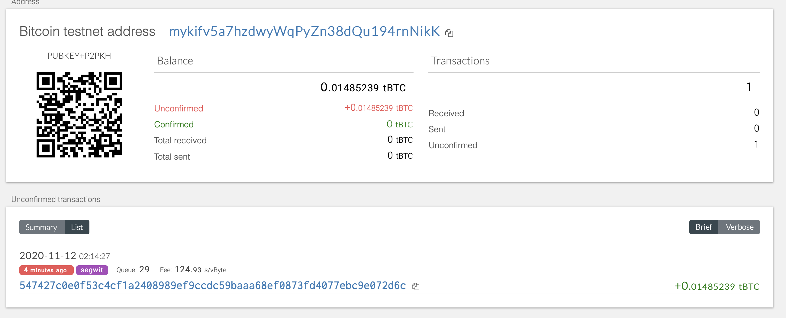

# BlockChain Wallet's with Python
**Dependencies:**
* PHP must be installed on your operating system (any version, 5 or 7).
    * You don't need to know any PHP though
* You will need to clone the hd-wallet-derive tool.
* bit Python Bitcoin library.
* web3.py Python Ethereum library.

**Project set-up:**
* Create a project directory called wallet and cd into it.
* Clone the hd-wallet-derive tool into this folder and install it using the instructions on it's README.md.
* Create a symlink called derive for the hd-wallet-derive/hd-wallet-derive.php script into the top level project directory like so
    * **``ln -s hd-wallet-derive/hd-wallet-derive.php derive``** 
    * This will clean up the command needed to run the script in our code, as we can call ./derive instead of ./hd-wallet-derive/hd-wallet-derive.php.
* Test that you can run the ./derive script properly.
* Create a file called wallet.py 
    * This will be your universal wallet script (see wallet.py file for code).

### **Setup constants:**
* In a separate file, constants.py, set the following constants:
    * **BTC = 'btc'**
    * **ETH = 'eth'**
    * **BTCTEST = 'btc-test'**
* In wallet.py, import all constants
    * **``from constants import``** 
* Use these anytime you reference these strings, both in function calls, and in setting object keys.

### **Generate a Mnemonic**
* Generate a new 12 word mnemonic using hd-wallet-derive 
    * Or by using this [tool](https://iancoleman.io/bip39/).
* Set this mnemonic as an environment variable, and include the one you generated as a fallback 
    * **``mnemonic = os.getenv('MNEMONIC', 'YOUR_MNEMONIC')``**

### **Making Transactions on Python**
* Use bit and web3.py
    * You have to create three functions to do this
* **``priv_key_to_account``**
    * This will convert the privkey string in a child key to an account object that bit/web3.py can use.
    * Parameters for functions:
        * coin -- COIN_TYPE(defined in constants.py)
        * priv_key -- PRIVKEY_STRING 
    * For ``ETH`` 
        * **``Account.privateKeyToAccount(priv_key)``**
        * This function returns an account object from the private key string. You can read more about this object [here](https://web3js.readthedocs.io/en/v1.2.0/web3-eth-accounts.html#privatekeytoaccount).
     * For ``BTCTEST``
         * **``PrivateKeyTestnet(priv_key)``**
* ``Create_tx`` 
    * This will create the raw, unsigned transaction that contains all metadata needed to transact. 
    * Parameters:
        * coin -- COIN_TYPE(defined in constants.py)
        * account -- YOUR_PRIV_KEY
        * to -- RECIPIENT_ADDRESS
        * amount -- AMOUNT_OF_COINS
* **Check the Coin**
    * For ``ETH``, return an object containing, make sure to calculate all of these values properly using web3.py!
        * to 
        * from
        * value
        * gas
        * gasPrice
        * nonce
        * chainID. 
    * For ``BTCTEST``, return 
        * **``PrivateKeyTestnet.prepare_transaction(account.address, [(to, amount, BTC)])``**
* ``Create_tx`` 
    * This will call create_tx, sign the transaction, then send it to the designated network.
    * Parameters:
        * coin -- COIN_TYPE(defined in constants.py)
        * account -- YOUR_PRIV_KEY
        * to -- RECIPIENT_ADDRESS
        * amount -- AMOUNT_OF_COINS
* ``send_tx`` 
    * This will call create_tx, sign the transaction, then send it to the designated network.
    * Parameters:
        * coin -- COIN_TYPE(defined in constants.py)
        * account -- YOUR_PRIV_KEY
        * to -- RECIPIENT_ADDRESS
        * amount -- AMOUNT_OF_COINS
**You may notice these are the exact same parameters as create_tx. send_tx will call create_tx, so it needs all of this information available.**
* Check the coin, then create a ``raw_tx`` object by calling ``create_tx`` then sign the ``raw_tx`` using bit or web3.py 
    * The account objects have a sign transaction function within
* Once you've signed the transaction send it to the designated blockchain network.
    * ``ETH``
        * **``w3.eth.sendRawTransaction(signed.rawTransaction)``**
    * ``BTCTEST``
        * **``NetworkAPI.broadcast_tx_testnet(signed)``**

### **Send some transactions!**
**Fund these wallets using testnet faucets.** 

* Open up a new terminal window inside of wallet, then run python. 
* Run: 
    * **``from wallet import *``** 
        * This should provide interactive functions, you should see something like this 

* Next set the account with the ``priv_key``, and use ``send_tx`` to complete a transaction

**Bitcoin Testnet transaction**
* Fund a ``BTCTEST`` address 
    * [Testnet faucet](https://testnet-faucet.mempool.co).
* Observe transactions on the address
    * [Block explorer](https://tbtc.bitaps.com) 
* Send a transaction to another testnet address 
    * Either one of your own, or the faucet's
* Your comfermation should look something similar to this

**Ganashe Ethereum transaction**
* Open up Ganashe and activate your ethereum accounts.
* Set the private key and call the ``send_tx`` function similar to btc-test.
* Set an address for the recipient
    * In the ``send_tx`` function include 
        * how many ``ETH`` to send (more then one) 
     * Your output should resemble this 

* Check Ganashe "transactions" tab and verify transaction went through
    * Your transaction should look similar to

**Congratulations you've just successfully sent a crypto transaction using Python!**
